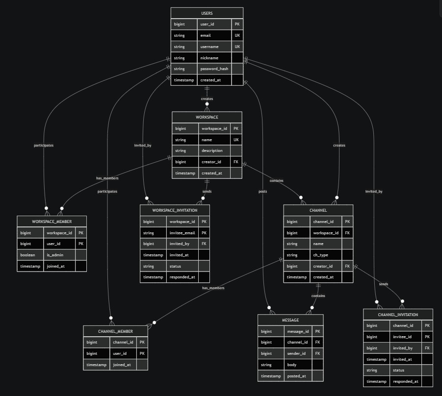
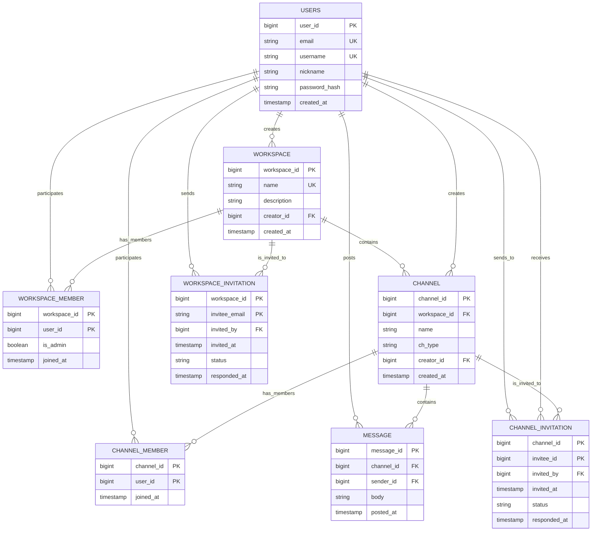
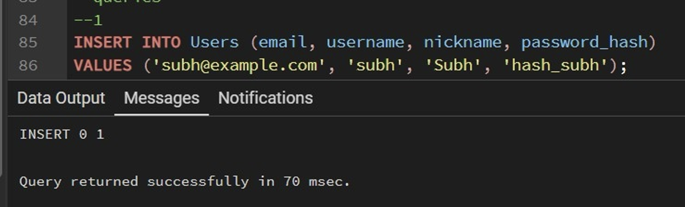
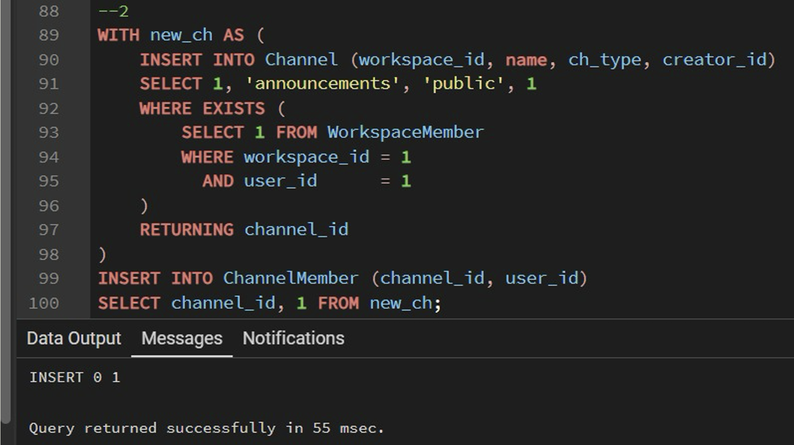
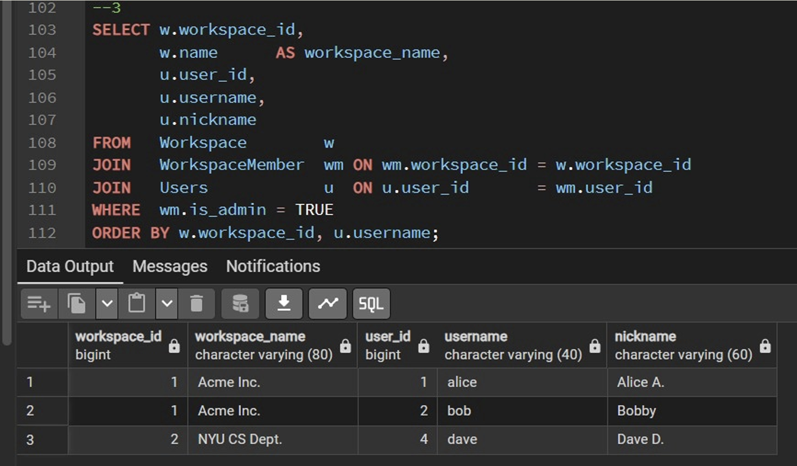
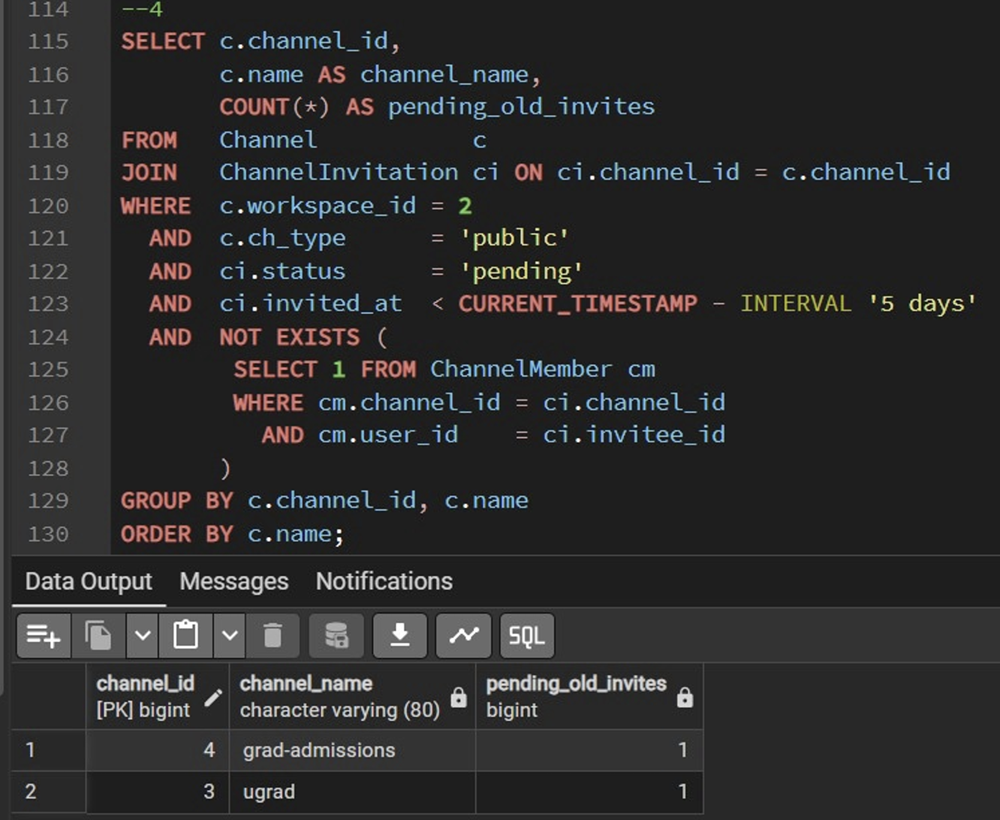
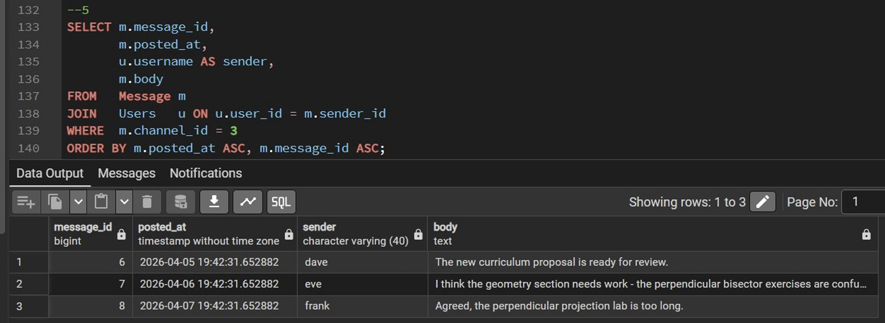
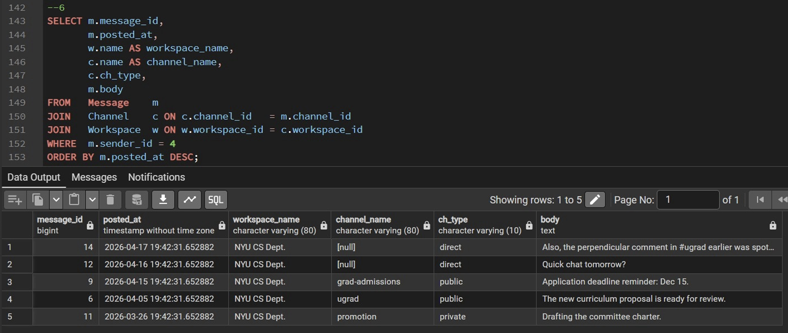
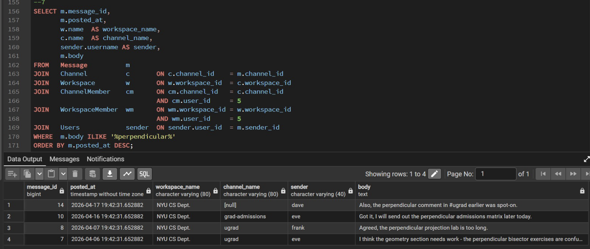

# snickr — Database Design Report

**Course:** CS6083, Spring 2026 — Project #1
**Due:** April 27, 2026

---

## Overview

Snickr is a Slack-like collaboration platform where users sign up with an email, choose a username and password, then create or join workspaces. Inside a workspace, members create channels of three kinds: public, private, and direct. Messages are exchanged chronologically within these channels.

This document addresses project requirements (a) through (e) as specified in the assignment.

---

## (a) Design and Justify an Appropriate Database Schema

### Entity-Relationship Design

#### Core Entities

The data model centers on four core entities:
- **User** — A sign-up account (email, username, nickname, password_hash)
- **Workspace** — Top-level container for channels and members (name, description, creator)
- **Channel** — Chat room of one of three types within a workspace (name, type, creator)
- **Message** — Text posted by users chronologically within channels (body, sender, timestamp)

#### Relationships and Junction Tables

- **WorkspaceMember** — Many-to-many relationship between User and Workspace, storing membership and admin status
- **ChannelMember** — Many-to-many relationship between User and Channel, tracking membership
- **WorkspaceInvitation** — Invitations from users to email addresses (email-based, allows pre-registration)
- **ChannelInvitation** — Invitations within workspaces to existing users
- **Message Authorship** — One-to-many from Users to Messages

#### ER Diagram



<details>
<summary>Mermaid source</summary>



</details>

### Relational Schema and Design Justification

The schema is composed of eight tables with clearly defined keys, foreign key constraints, and validation rules. Each design decision is justified with reference to the project requirements.

#### Eight Tables with Keys and Foreign Keys

| Table | Primary Key | Unique Keys | Foreign Keys | Delete Behavior |
|-------|-------------|-------------|--------------|-----------------|
| Users | user_id (BIGINT GENERATED) | email, username | None | — |
| Workspace | workspace_id (BIGINT GENERATED) | name | creator_id → Users | RESTRICT on creator |
| WorkspaceMember | (workspace_id, user_id) | None | workspace_id → Workspace, user_id → Users | CASCADE both |
| WorkspaceInvitation | (workspace_id, invitee_email) | None | workspace_id → Workspace, invited_by → Users | CASCADE workspace |
| Channel | channel_id (BIGINT GENERATED) | (workspace_id, name) WHERE ch_type != 'direct' | workspace_id → Workspace, creator_id → Users | CASCADE workspace |
| ChannelMember | (channel_id, user_id) | None | channel_id → Channel, user_id → Users | CASCADE both |
| ChannelInvitation | (channel_id, invitee_id) | None | channel_id → Channel, invitee_id → Users, invited_by → Users | CASCADE channel |
| Message | message_id (BIGINT GENERATED) | None | channel_id → Channel, sender_id → Users | CASCADE channel |

**Important Design Note on Invitations:**
The `WORKSPACE_INVITATION` table intentionally does not use a foreign key for `invitee_email`, since the spec allows inviting someone who hasn't registered yet. Once they sign up and accept, a `WORKSPACE_MEMBER` row is created and the status changes to `'accepted'`. Channel invitations, by contrast, do require `user_id` to exist because you can only be invited to a channel inside a workspace you're already a member of.

#### CHECK Constraints and Validation

| Table | Constraint | Purpose |
|-------|-----------|---------|
| Users | `email LIKE '_%@_%.__%'` | Basic email shape validation |
| Users | username matches `[A-Za-z0-9_.-]`, length 3–40 | Username format and length |
| Workspace | (implicit via UNIQUE) | Workspace names must be globally unique |
| Channel | `ch_type IN (public, private, direct)` | Channel type restricted to three values |
| Channel | `ch_type = 'direct' OR name IS NOT NULL` | Direct channels don't require names; others must |
| Channel | partial unique index: `(workspace_id, name) WHERE ch_type != 'direct'` | Channel names unique per workspace except direct |
| WorkspaceInvitation | `status IN (pending, accepted, declined, revoked)` | Invitation state machine |
| ChannelInvitation | `status IN (pending, accepted, declined, revoked)` | Invitation state machine |

#### Design Assumptions and Rationale

**1. Surrogate Keys for Primary Identity**
Slack-scale datasets quickly exceed 32-bit integers. Natural keys like email and workspace names are wide and expensive as foreign key references. Surrogate BIGINT keys allow usernames and channel names to change without cascading updates.

**2. Email Uniqueness is Global**
Email is the spec's sign-up identifier. Each email belongs to exactly one user. This is enforced via UNIQUE constraint and simplifies authentication.

**3. Workspace Names are Globally Unique**
Simplifies discovery and invitation. Future versions could relax this to per-creator uniqueness `(creator_id, name)` if needed.

**4. Admin Status as a Boolean Column**
Rather than a separate Administrator table, `is_admin BOOLEAN` in `WorkspaceMember` models admin status directly. This works because every admin must also be a member, avoiding redundant referential constraints.

**5. Workspace Invitations Use Email (Not user_id)**
The spec explicitly allows inviting someone who hasn't signed up yet. Email-based invitations support this. After sign-up and acceptance, a `WorkspaceMember` row is inserted and the invitation status becomes `'accepted'`.

**6. Channel Invitations Use user_id (Recipient Must Exist)**
Channel invitations only make sense for existing workspace members. Direct `user_id` references provide simpler validation and no ambiguity about unregistered invitees.

**7. Direct Channels Have No Name**
Direct (1-to-1) channels are identified solely by their two `ChannelMember` rows. This avoids synthetic names like `dm-3-7`, since the UI normally shows the other participant. The partial unique index allows multiple unnamed direct channels in a workspace without constraint violations.

**8. No Cascading Delete on Creator Foreign Keys**
`Workspace.creator_id` has `ON DELETE RESTRICT` and `Channel.creator_id` has no cascade. Deleting a user should not silently delete their workspaces or channels. This prevents accidental data loss; a production system would reassign ownership or archive instead.

**9. Timestamps on All Actions**
Every significant action is timestamped: user creation, workspace creation, message posting, invitation send/respond, and member join. This is required for Query 4 and enables audit trails. `posted_at` and `joined_at` are indexed for performance.

**10. No Deletion of Messages or Channels**
The spec does not require deletion support. Cascading deletes exist for administrative cleanup (workspace deletion cascades to channels and messages), but the application doesn't expose delete endpoints. This simplifies the model and keeps audit trails intact.

**11. No Permission Rows or Views for Access Control**
The database itself is not multi-tenant. All data is visible to the application code. Access control is enforced in the application layer via session cookies and membership checks, not via database permissions. Per the spec: the system sees all content but enforces access at the application level.

**12. Space Efficiency**
We use surrogate BIGINT PKs instead of wide natural keys. Membership and admin status share one `WorkspaceMember` row instead of duplicating data in a separate Administrator table. Direct channels don't store names (nullable column with partial unique index). Invitations and memberships are separate to avoid storing per-row `invited_by`/`invited_at` on every membership.

#### Indexes for Query Performance

- `idx_msg_channel_time (channel_id, posted_at)` — Query 5: chronological message list in a channel
- `idx_msg_sender (sender_id)` — Query 6: all messages by a user
- `idx_msg_body_trgm` (GIN, full-text) — Query 7: keyword search on message body
- `idx_wm_user`, `idx_cm_user` — Fast "what workspaces/channels does this user belong to?" lookups, used by Query 7 authorization joins and almost every page

Full DDL with all constraints and indexes is in [`schema.sql`](schema.sql).

---

## SQL Queries / Test Data / Query Validation

The seven required queries are in [`queries.sql`](queries.sql); bound versions exercising edge cases are in [`test_queries.sql`](test_queries.sql) and captured output in [`test_results.txt`](test_results.txt).

### Query Runs (pgAdmin)

**Query 1 — Create a new user account**



**Query 2 — Create a public channel inside a workspace (with authorization check)**



**Query 3 — For each workspace, list all current administrators**



**Query 4 — Per public channel, count users invited >5 days ago who haven't joined**



**Query 5 — All messages in a channel, chronologically**



**Query 6 — All messages posted by a particular user, across any channel**



**Query 7 — Accessible messages containing the keyword "perpendicular"**




### Test Data Overview

The data set in [`sample_data.sql`](sample_data.sql) is intentionally minimal but engineered to hit every edge case required by the seven queries. It contains 6 users, 2 workspaces, 5 named channels (plus 1 direct channel), and carefully placed invitations and messages.

### Test Data Diagram

```
┌──────────────────────────────────────────────────────────────────────────────┐
│ USERS (6 total)                                                              │
├──────────────────────────────────────────────────────────────────────────────┤
│ 1. alice@example.com  [alice]   2. bob@example.com    [bob]                  │
│ 3. carol@example.com  [carol]   4. dave@nyu.edu       [dave]                 │
│ 5. eve@nyu.edu        [eve]     6. frank@nyu.edu      [frank]                │
└──────────────────────────────────────────────────────────────────────────────┘
                                    ↓
┌──────────────────────────────────────────────────────────────────────────────┐
│ WORKSPACE 1: "Acme Inc." (creator: alice)                                    │
├──────────────────────────────────────────────────────────────────────────────┤
│ MEMBERS:  alice (admin*), bob (admin*), carol (member)                       │
│ INVITATIONS:                                                                 │
│   - carol@     → ACCEPTED (20d ago → now member)                             │
│   - dave@nyu   → PENDING   (2d ago, cross-org)                               │
│                                                                              │
│ CHANNELS:                                                                    │
│ • #general (public, creator: alice)                                          │
│     members: {alice, bob, carol}                                             │
│     3 messages                                                               │
│                                                                              │
│ • #hiring (private, creator: bob)                                            │
│     members: {alice, bob}                                                    │
│     2 messages                                                               │
└──────────────────────────────────────────────────────────────────────────────┘
                                    ↓
┌──────────────────────────────────────────────────────────────────────────────┐
│ WORKSPACE 2: "NYU CS Dept." (creator: dave)                                  │
├──────────────────────────────────────────────────────────────────────────────┤
│ MEMBERS:  dave (admin*), eve (member), frank (member)                        │
│ INVITATIONS:                                                                 │
│   - frank@     → ACCEPTED (40d ago → now member)                             │
│   - alice@     → DECLINED (9d ago)                                           │
│                                                                              │
│ CHANNELS:                                                                    │
│ • #ugrad (public, creator: dave)                                             │
│     members: {dave, eve, frank}                                              │
│     invitations: alice (PENDING, 7d old) ← Query 4 candidate                 │
│     3 messages (2 contain "perpendicular")                                   │
│                                                                              │
│ • #grad-admissions (public, creator: dave)                                   │
│     members: {dave, eve}                                                     │
│     invitations: frank (PENDING, 8d old) ← Query 4 candidate                 │
│                  alice (PENDING, 1d old) ← filtered (too recent)             │
│     2 messages (1 contains "perpendicular")                                  │
│                                                                              │
│ • #promotion (private, creator: dave)                                        │
│     members: {dave}                                                          │
│     invitations: eve (PENDING, 20d old) ← Not in Query 4 (private)           │
│     1 message (dave only, private)                                           │
│                                                                              │
│ • (direct, creator: dave, type: direct, no name)                             │
│     members: {dave, eve}                                                     │
│     3 messages (1 contains "perpendicular")                                  │
└──────────────────────────────────────────────────────────────────────────────┘

LEGEND:
  * = admin
  PENDING invitation 7d+ old = candidate for Query 4
  PENDING invitation <5d old  = filtered by Query 4
  "perpendicular" = keyword for Query 7 testing
```

### Why the Data is Structured This Way

The 6-user, 2-workspace, 5-named-channel test set covers all edge cases required by the 7 queries:

| Feature | How Tested | Location |
|---------|-----------|----------|
| Multiple admins | alice and bob both admin in Acme | ws1, Query 3 |
| Cross-workspace boundaries | alice invited to both but declined ws2 | invitations, Query 7 |
| Old vs. recent pending invites | frank 8d old included, alice 1d old excluded | #grad-admissions, Query 4 |
| Invite to member transition | carol invited 20d ago, now member | ws1, Query 4 NOT EXISTS |
| Private channel with pending invite | eve invited to #promotion but not member | #promotion, Query 7 |
| Keyword access control | "perpendicular" in public, private, direct | Query 7 multi-perspective |
| Chronological ordering | messages from 30d ago to present | Query 5 |
| User message collection | dave has 5 messages across 4 channels | Query 6 |

---

## (e) Documentation and Design Summary

### Operational Notes and Implementation Considerations

**Transactions** — Query 2 is shown as a CTE `INSERT ... RETURNING` followed by the membership insert. In production code the two statements should be wrapped in `BEGIN ... COMMIT` so that a crash between them cannot leave a channel without its creator as a member.

**Application-level authorization** — As the spec requires, no DB-level user accounts are used for end-users. The web tier authenticates the user via cookies and includes the user's `user_id` in every authorization predicate. Query 7 shows the canonical example of how per-message access control is implemented as a JOIN on the membership tables.

**Password storage** — `password_hash` stores a bcrypt or argon2 hash; the application never stores or transmits plaintext. The column is sized generously (255 chars) to accommodate any reasonable hash format.

**Time zones** — All timestamps are stored as `TIMESTAMP` (server-local). In production we would prefer `TIMESTAMPTZ`, which is a one-line change that doesn't affect any of the queries.

---

## How to Reproduce

```bash
createdb snickr
psql -d snickr -v ON_ERROR_STOP=1 -f schema.sql
psql -d snickr -v ON_ERROR_STOP=1 -f sample_data.sql
psql -d snickr -v ON_ERROR_STOP=1 -f test_queries.sql | tee test_results.txt
```
